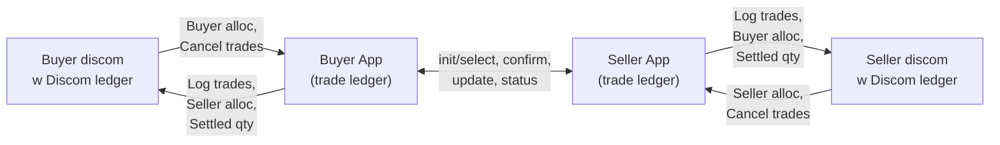
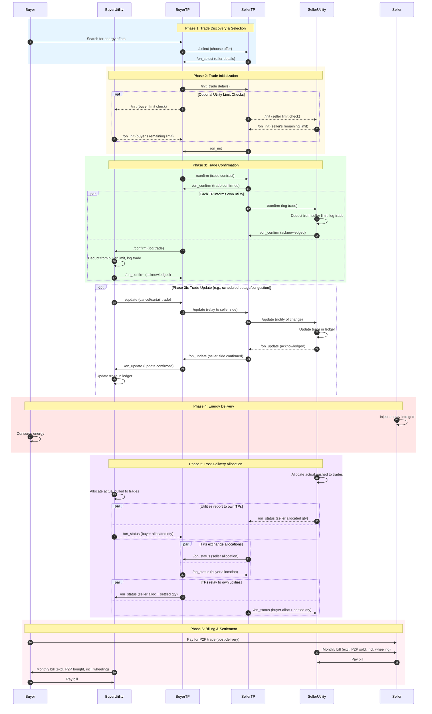

# Inter-Energy Retailer P2P Energy Trading (Decentralized Approach)

## Overview

This document describes an alternative approach to inter-energy retailer P2P trading that **eliminates the need for a central trade exchange/ledger**. Instead, each utility maintains its own ledger for its customers, and trust is established through cascading Beckn protocol calls with multi-party digital signatures.

For the original approach using a central ledger, see [Inter_energy_retailer_P2P_trading_draft.md](./Inter_energy_retailer_P2P_trading_draft.md).

---

## Scenario

P2P trading between prosumers belonging to different energy retailers/distribution utilities (discoms). Each discom handles routine activities: providing electricity connections, certifying meters, billing, maintaining grid infrastructure, and ensuring grid resilience within their jurisdiction.

**Example:** A seller (Meter ID: M1, Utility A) sells electricity to a buyer (Meter ID: M7, Utility B).

---

## Key Architectural Difference

| Aspect | Central Ledger Approach | Decentralized Approach |
|--------|------------------------|------------------------|
| Trade records | Single central ledger (Trade Exchange) | Each utility maintains its own ledger |
| Trust model | All parties trust the central ledger | Multi-party signatures create distributed proof |
| Trading limits | Central ledger tracks all limits | Each utility tracks only its own customers' limits |
| Reconciliation | Central ledger allocates actual energy | Each utility allocates for its own customers |
| Privacy | Central entity sees all trade details | Each utility only sees trades involving its customers |

---

## Actors

| # | Actor | Role | Beckn Role |
|---|-------|------|------------|
| 1 | **BuyerTP** | Consumer's trading platform | BAP when requesting, BPP when responding |
| 2 | **SellerTP** | Producer's trading platform | BAP when requesting, BPP when responding |
| 3 | **BuyerUtility** | Buyer's energy retailer/distribution company | BAP when requesting, BPP when responding |
| 4 | **SellerUtility** | Seller's energy retailer/distribution company | BAP when requesting, BPP when responding |
| 5 | **Buyer** | Energy consumer in P2P trade | End user |
| 6 | **Seller** | Energy producer in P2P trade | End user |

> **Note:** When buyer and seller are with the **same utility**, the flow simplifies naturally - BuyerUtility and SellerUtility collapse into a single entity, reducing the number of hops while maintaining the same protocol structure.

---

## Core Design Principles

1. **Symmetric TP-liaison model**: Each trading platform acts as the sole liaison to its own utility. No utility communicates directly with the counterparty's TP. Cross-utility information flows TP-to-TP only.
2. **Privacy-preserving information flow**: Only allocations are exchanged between TPs and utilities — not customer IDs, PII, or meter data. Price information stays between trading platforms only. Intra-discom trade data stays in the discom's own ledger.
3. **Utility involvement patterns**: Utility participation during init is optional, and only needed when trading platforms don't have the trading limits imposed by the utility. After the trade is confirmed, each TP sends a non-blocking intimation to its own utility, informing them of the trade so they can avoid double-billing and compute wheeling and under-fulfillment charges post delivery. Utilities can independently track and publish trade reliability scores (e.g., CIBIL for energy).
4. **Distributed ledgers**: Each utility maintains its own ledger for its customers only
5. **Natural collapse**: Same-utility trades collapse to single-discom flow automatically

---

## Architecture Overview

> **Key properties:** Each TP acts as the sole liaison to its own utility. Trade protocol flows (init, select, confirm, update, status) stay between TPs. Only allocations and settled quantities cross the TP-utility boundary — not customer IDs, PII, meter data, or price information. Intra-discom trade data stays in the discom's own ledger.

---

## Overall Process Flow

---

## Phase 5: Post-Delivery Allocation and Status

After the delivery window, each utility performs allocation independently for its own customers and reports to its own TP. The TPs then exchange allocations and compute settled quantities, relaying both the counterparty's raw allocation and the settled quantity back to their respective utilities for verification.

### Why Allocation Matters

A prosumer may have multiple trades in the same delivery window but inject/consume less than the total contracted amount. Each utility must allocate actual meter readings to specific trades to determine:
- What quantity was actually delivered/received for each trade
- What to include in billing adjustments
- Whether penalties apply for under-delivery

### Allocation Example (Pro-rata)

**Seller's trades for delivery window 2-4 PM:**

| Trade | Contracted Qty | Share of Total |
|-------|----------------|----------------|
| T1 (with Buyer A) | 5 kWh | 5/9 ≈ 55.6% |
| T2 (with Buyer B) | 4 kWh | 4/9 ≈ 44.4% |
| **Total** | **9 kWh** | **100%** |

**Actual injection: 7 kWh**

**SellerUtility allocation (pro-rata):** Under-fulfillment (7 of 9 kWh) is distributed proportionally across all trades for that meter and time block.

| Trade | Contracted | Allocated | Status |
|-------|------------|-----------|--------|
| T1 | 5 kWh | 3.89 kWh (5/9 × 7) | Partial delivery |
| T2 | 4 kWh | 3.11 kWh (4/9 × 7) | Partial delivery |

SellerUtility sends `/on_status` to SellerTP with these allocated quantities.
